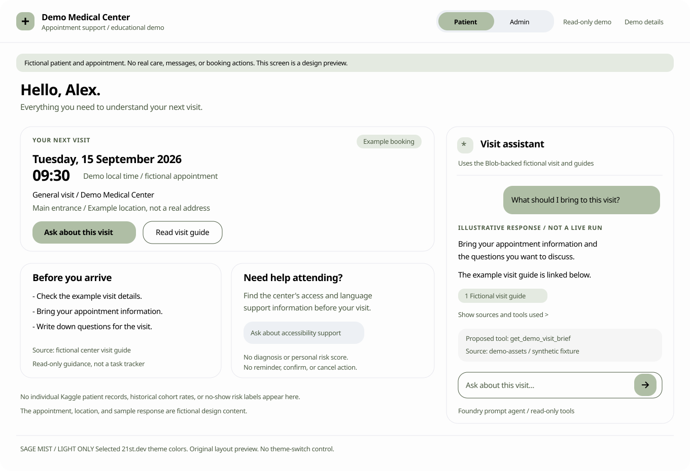
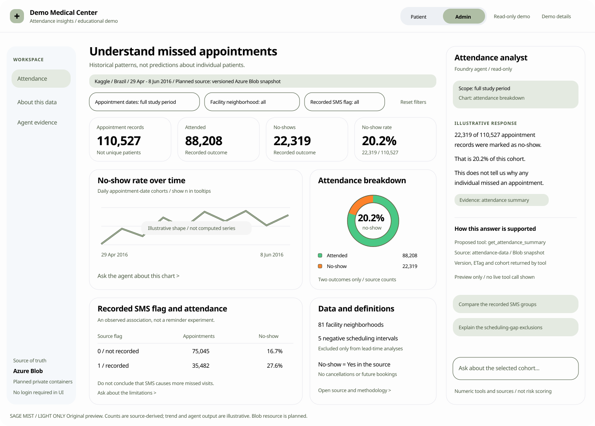

# Application and Azure services plan

**Status:** Design proposal, not implemented.
**Research snapshot:** 2026-09-08.
**Scope:** Patient/admin UI, application behavior, Azure services, data ingestion, and agent-tool contracts.
**Notebook curriculum:** [Foundry notebook workshop plan](notebook-workshop-plan.md).

This document owns application and infrastructure decisions. The linked notebook
curriculum is a separate, general Foundry workshop: its notebooks do not depend
on this application's data, tool contracts, or backend. This application may be
used as an optional Day 3 demonstration. Participants do not implement this plan
or provision shared infrastructure as a notebook lesson.

## 1. Recommendation

Build two views of one educational demo, not a hospital-management application:

| View | The question it answers | Main visual | Agent's role |
| --- | --- | --- | --- |
| Patient | "What do I need to know about my next visit?" | A clear appointment card and concise visit information. | A contextual visit assistant that explains the example appointment and cites approved guidance. |
| Admin | "What patterns do we observe in missed appointments?" | Historical attendance metrics, a trend chart, an outcome donut, and focused comparisons. | An attendance analyst that explains the selected cohort using exact calculations and visible evidence. |

Use a persistent **Patient / Admin** button group in the header. No login, registration, account menu, role assignment, or access-control claims.

Use the user-selected **[Sage Mist by Serafim](https://21st.dev/@serafimcloud/themes/sage-mist)** theme in **light mode only**. Apply its actual sage primary, dark-green accent, Plus Jakarta Sans typography, and rounded cards to both views. There is no dark mode, theme toggle, or automatic system-theme switching.

The point of the demo is to connect **data -> chart -> question -> agent tool -> supported explanation**. A beautiful dashboard without this connection would miss the workshop's purpose.

## 2. Confirmed decisions and scope

- The user selected **read-only appointment information and assistant**. No simulated confirmation, reminder preferences, booking, rescheduling, or cancellation actions.
- The user selected the original [Joni Hoppen medical appointment no-show dataset](https://www.kaggle.com/datasets/joniarroba/noshowappointments/data) for the admin analytics.
- The patient remains a clearly labelled fictional example, separate from historical Kaggle patient records.
- Both views incorporate the agent as a visible part of the workflow.
- The frontend/backend remain local; models and Foundry backing services remain on Azure.
- The selected historical dataset must live in **Azure Blob Storage**. Add a workstream to provision one dedicated storage account, upload a versioned dataset, and connect the backend's read-only agent tools to it. Do not assume the organizer already created this storage resource.
- The user approved an **Entra-authenticated public endpoint with private containers** for laptop access. "Public endpoint" does not mean anonymous blob access.
- Draft exactly four useful function tools for this slice; their contracts are specified below. Implementation and provisioning require execution approval.
- This slice shows observed outcomes, not an individual no-show prediction model.
- Historical attendance analysis uses the curated Kaggle cohort. The fictional patient, procedure documents, and small explicitly labelled teaching fixtures remain synthetic; none is silently substituted for the historical cohort.

Do not use a global "All data is synthetic" banner anymore: it would be false for the admin view. Use a global educational notice plus a view-specific provenance label.

## 3. What exists today

The inspected checkout has one narrow chat screen with a heading, disclaimer, message list, and input. It has no admin/patient split, charts, appointment cards, or evidence panel.

Its current starter text asks users to describe symptoms. Replace that direction with appointment and attendance questions when this design is implemented.

The stack is React 18 + TypeScript + Vite with plain CSS. The API sends one message to `/api/chat` and receives only `{ reply }`; displayed chat history is not sent as conversation context. Source citations, filters, tools, and multi-turn context therefore need a real response/context contract, not just additional visual decoration.

A separate frontend redesign PR was open during inspection. Reconcile this proposal with the selected integration branch before implementation; do not treat that unmerged design as already present in this checkout.

## 4. Data truth before dashboard design

### Verified source facts

The original `KaggleV2-May-2016.csv` was parsed in memory. No individual patient rows were displayed or saved into the repository.

| Fact | Observed value |
| --- | --- |
| Appointment records | 110,527 |
| Attended: `No-show = No` | 88,208 |
| Did not attend: `No-show = Yes` | 22,319 |
| No-show rate | 20.1933%, displayed as **20.2%** |
| Appointment-date range | 29 April through 8 June 2016 |
| Facility neighborhoods | 81 |
| Negative scheduling-to-appointment calendar intervals | 5 rows |
| Negative age | 1 row |

These are appointment counts, not unique-patient counts. Do not reuse the dataset page's "30%" subtitle as a calculated KPI.

Relevant source fields are `ScheduledDay`, `AppointmentDay`, `Neighbourhood`, `SMS_received`, and `No-show`. Preserve the raw-to-display mapping in the data dictionary.

The file also contains patient/appointment identifiers, demographics, and health/social fields. They are not necessary for the core UI. Do not expose them in the patient page, send raw rows to the model, or offer health-condition/welfare segmentation merely because those columns exist.

### Fields the dataset does not support

| Tempting UI element | Why it would be misleading | Use instead |
| --- | --- | --- |
| "Today's schedule" or upcoming appointments | The appointments are historical. | "Study period: 29 Apr - 8 Jun 2016." |
| Departments, named doctors, visit reasons | Those fields are absent. | Facility neighborhood and appointment-date cohorts. |
| A patient's future appointment time | Appointment dates do not provide a real booking-slot schedule. | An explicitly fictional patient fixture, not a fabricated Kaggle attribute. |
| Cancelled, confirmed, rescheduled, pending outcomes | The source outcome is binary attendance. | Attended / No-show only. |
| Reminder delivered, read, or effective | The SMS field cannot establish delivery, engagement, or causal effect. | "Recorded SMS flag" with a definition and limitation. |
| Patient travel-distance map | `Neighbourhood` is the facility neighborhood, not residence. | A ranked aggregate comparison with sample counts. |
| Revenue lost or slots recovered | No price, cost, intervention, or recovery data. | Observed appointment counts and rates. |
| "High-risk patients" list | No trained/validated prediction workflow is part of this demo. | Cohort-level descriptive analytics. |

### Metric and filtering rules

- Calculate `no_show_rate = no_show_count / (attended_count + no_show_count)` for the selected eligible cohort. A zero denominator displays "No data", not 0%.
- An unexpected outcome value is a data-quality issue, not silently counted as attendance.
- Use appointment dates for the dashboard period. Preserve source calendar dates rather than shifting midnight timestamps through the browser's local timezone.
- Define lead time as appointment calendar date minus scheduling calendar date, not rounded elapsed hours.
- Keep all valid attendance outcomes in the headline totals. Exclude the five negative intervals only from lead-time analyses, with the exclusion and applicable denominator visible.
- The negative-age row does not invalidate attendance counts; age is not a core filter here.
- Default to the full study period. Suitable presets are "Full study" and "May 2016", not "This month" or "Last 30 days" relative to today.
- Every comparison shows sample count `n`. For groups below a proposed minimum of 30 records, show a small-sample warning and omit rates from rankings. This is a presentation safeguard, not a claim of statistical significance or anonymization.
- Derive the chart, table, and agent's metric evidence from the same aggregation functions and dataset version.
- Do not add previous-period arrows when there is no complete comparable period. Show no delta rather than inventing a trend.

### Data rights

Kaggle's original metadata declares **CC BY-NC-SA 4.0**. Preserve attribution and review suitability for the intended workshop/commercial context before distributing the CSV or derived packaged assets. The UI plan can reference and analyze the selected source without assuming unrestricted redistribution.

Do not silently substitute synthetic admin data if access or permissions block use. Explain the limitation and get an explicit decision.

## 5. Visual direction: Sage Mist, light only

Selected preview: [Sage Mist in the 21st.dev gallery](https://21st.dev/community/components?qs=bookmarks&preview=%2F%40serafimcloud%2Fthemes%2Fsage-mist).

The following tokens were inspected directly on that live preview, rather than inferred from the theme name. OKLCH is the source value; hexadecimal values are browser-converted approximations for the SVG wireframes.

| Token | Source OKLCH | Approximate hex | Use |
| --- | --- | --- | --- |
| Background / card | `0.994 0 0` | `#FDFDFD` | Main canvas and cards |
| Foreground | `0 0 0` | `#000000` | Main text and primary-button labels |
| Primary / ring | `0.783 0.038 132.737` | `#AFBEA5` | Sage selected states and main actions |
| Accent | `0.443 0.044 134.507` | `#495940` | Dark-green emphasis, links, accessible outlines |
| Accent foreground | `1 0 0` | `#FFFFFF` | Text on dark-green accent |
| Secondary | `0.954 0.006 255.476` | `#EDF0F4` | Secondary controls |
| Muted | `0.97 0 0` | `#F5F5F5` | Quiet inset surfaces |
| Muted foreground | `0.623 0 0` | `#878787` | Nonessential visual de-emphasis; see accessibility note |
| Border | `0.93 0.009 286.216` | `#E7E7EE` | Decorative separation |
| Sidebar | `0.978 0.005 247.876` | `#F5F8FB` | Admin navigation surface |
| Sidebar accent | `0.93 0.014 134.9` | `#E4EAE1` | Selected navigation and context chips |
| Chart 1 | `0.746 0.148 156.45` | `#4AC885` | Attended series |
| Chart 3 | `0.734 0.176 50.552` | `#FD822B` | No-show series; not a danger/risk badge |
| Chart 2 / 4 / 5 | See selected theme | `#7033FF` / `#3276E4` / `#747474` | Reserve for genuinely needed comparison series |

Use **Plus Jakarta Sans**, with an ordinary sans-serif fallback and a locally bundled font for the implementation. The preview may use an installed fallback font. Theme base radius is **1.4rem**, spacing unit **0.27rem**, and letter spacing **-0.025em**. Preserve its restrained shadow treatment; do not copy the sample preview's revenue, subscription, login, or payment widgets.

Both view previews now use this one light theme. Set the application color scheme to light; do not inherit the browser/OS dark preference or persist a theme selection. The only prominent mode switch is Patient/Admin.

Accessibility note: source `muted-foreground` on the background is approximately **3.53:1**, so do not use it for essential small text. Keep the original tokens, but use foreground or the dark-green accent for important small labels. Primary-button black text is approximately **10.73:1** against sage. Keep explicit chart labels, segment separators, and sufficiently contrasting outlines; do not rely on the brighter chart colors alone.

No hospital stock photography, pulsing "AI" glows, animated blobs, 3D pie charts, huge gradients, or punitive patient colors.

## 6. Patient page

### Layout and priorities



*Original nonfunctional wireframe. All patient details, document snippets, and the sample response are fictional. This is not a live agent run.*

| Priority | Region | Contents and purpose |
| --- | --- | --- |
| First | Header | Demo Medical Center, visible Patient/Admin switch, read-only notice, optional Demo details. No theme control. |
| First | Provenance banner | "Fictional patient and appointment. Educational demo; no real care or booking actions." |
| First | Next-visit card | Plain date/time, example visit label, fictional location, and "Ask about this visit." |
| First | Visit assistant | Visible contextual help, suggested questions, response, and source chips. |
| Second | Before you arrive | Short read-only preparation list sourced to the fictional center guide. |
| Second | Need help attending? | Access/language-support information and "Ask about accessibility support." |
| Optional | Past example visits | A small fictional history only if it helps the lesson; not a second dashboard. |

The patient should understand what to do to prepare, not be confronted with cohort statistics or judged for attendance.

### Appointment fixture

Use one deliberately fictional profile such as "Alex - demo patient." The preview uses an example appointment on 15 September 2026 at 09:30.

The future appointment, location, visit type, and display name are authored fixture fields. Do not join them to a Kaggle `PatientId` or imply that they are derived from the source.

Display an absolute example date with its demo-local timezone convention. Do not show an unattended "Tomorrow" countdown that becomes false after the presentation date.

### Patient interactions

- **Ask about this visit** focuses the assistant with the selected fictional appointment context and an editable suggested question.
- **Read visit guide** opens a read-only document drawer with title, version, and fictional-source label.
- Suggested questions include "What should I bring?", "Where do I find arrival information?", and "What language support does the center describe?"
- Source chips open the cited guide section, not a generic unrelated homepage.
- **Show sources and tools used** expands a quiet evidence area for workshop participants; keep it collapsed by default for the patient view.
- A request to confirm, cancel, or send a reminder receives a clear explanation that this demo cannot perform the action. No success toast or fabricated booking update.

Do not include a no-show probability, compliance score, reminder-effectiveness claim, raw cohort chart, or clinician recommendation on this page.

## 7. Admin page

### Layout and priorities



*Original nonfunctional wireframe in the selected light-only theme. KPI counts, donut proportions, and SMS-group rates are source-derived. Trend geometry and the agent response are labelled illustrative.*

The page headline is **Understand missed appointments**, with the subtitle **Historical patterns, not predictions about individual patients**.

Use a compact sidebar with in-page sections: Attendance, About this data, Agent evidence. Do not add navigation items for nonexistent billing, staff management, clinical records, or settings.

### Above the fold

| Region | Contents |
| --- | --- |
| Source strip | Dataset name, historical date range, source/version link, and active cohort size. |
| Filters | Appointment-date range, facility neighborhood, recorded SMS flag; clear/reset control. |
| KPI cards | Appointment records, attended, no-shows, no-show rate. No invented comparison arrows. |
| Main trend | Daily no-show rate with appointment count in the tooltip and an accessible table. |
| Outcome donut | Two segments only: attended and no-show, with explicit labels/counts and the denominator. |
| Attendance analyst | Context-aware assistant panel with the selected cohort and chart visible. |

The default full-study KPIs are **110,527**, **88,208**, **22,319**, and **20.2%**.

### Secondary analytical area

Use one comparison card with simple tabs rather than showing every possible chart at once:

| Comparison | Visualization | What it teaches |
| --- | --- | --- |
| Scheduling gap | Horizontal bars for same day, 1-7, 8-30, and 31+ calendar days; rates and `n`. | A descriptive association and the effect of explicit data-quality exclusions. |
| Recorded SMS | Two groups, source flag 0 and 1, with attended/no-show counts and rate. | Why an association is not evidence that reminders worked or failed. |
| Facility neighborhood | Selected/high-volume neighborhoods with counts, rates, and small-sample handling. | Cohort comparison without pretending to know residence or geography. |

The preview illustrates the Recorded SMS tab:

| Recorded flag | Appointments | No-shows | No-show rate |
| --- | --- | --- | --- |
| 0 | 75,045 | 12,535 | 16.7% |
| 1 | 35,482 | 9,784 | 27.6% |

The accompanying explanation must say that these are observational groups. The higher recorded-SMS group's rate does **not** show that SMS causes missed appointments. The dataset cannot establish reasons, random assignment, delivered/read status, or intervention effects.

An **Inspect aggregate table** action opens the exact values supporting a chart. It never opens a raw patient list.

### Chart rules

- Counts use a zero baseline; rates have explicit percentage axes, denominators, and sensible consistent scales.
- Distinguish missing observations from 0%; do not connect a line through an absent day as if it were observed.
- Prefer a line chart and a two-segment donut over multiple pie charts. A donut is useful here because the outcome really is binary.
- Do not combine appointment volume and rates on an unexplained dual axis.
- Make labels and counts sufficient without color. Give adjacent donut segments a visible separator.
- A click on a chart or the explicit **Ask about this chart** button selects context; it does not automatically incur a model call.

## 8. The agent is part of the page, not an accessory

### Two modes, one coherent assistant experience

| Mode | Visible name | Allowed context | Suitable questions |
| --- | --- | --- | --- |
| Patient | Visit assistant | Selected fictional appointment and approved public center/education documents. | "What should I bring to this example visit?" |
| Admin | Attendance analyst | Versioned cohort aggregates, filters, metric definitions, and approved center procedures. | "Explain this rate"; "What can we conclude from the SMS comparison?"; "Why are five rows excluded here?" |

Keep separate conversation/context state for patient and admin. Switching modes must not carry an admin answer, chart selection, raw source data, or tool result into the patient's chat.

Use the established Foundry prompt-agent direction from the workshop. The backend supplies a constrained mode/context and uses an appropriate tool allowlist or configured agent version. The role button is a demo context switch, not evidence of identity authorization.

### Contextual entry points

- Admin chart footer: **Ask about this chart**.
- Admin KPI menu: **Explain this number**.
- Comparison card: **What are the limitations?**
- Patient appointment card: **Ask about this visit**.
- Patient guide: **Explain this section**.

Show a removable context chip above the composer: for example, "Attendance / full study / recorded SMS = all." The user sees what the agent is answering about.

Use suggested questions to make the system discoverable, but keep an ordinary editable text composer. Clicking a suggestion prepares the question; sending it is explicit.

### Four drafted agent tools

These are concrete function-tool specifications, not implemented Python functions yet. They all read approved Blob-backed snapshots through the local backend. None lets the model browse arbitrary containers, submit code/SQL, or retrieve historical patient identifiers.

| Tool | Friendly label | Why it is useful | Mode |
| --- | --- | --- | --- |
| `get_attendance_summary` | Explain the numbers | Supplies exact KPIs and the time series behind the dashboard. | Admin |
| `compare_attendance_groups` | Compare attendance patterns | Compares scheduling gaps, weekdays, recorded SMS, or facility neighborhoods without making causal claims. | Admin |
| `explain_attendance_data` | Check the evidence | Explains field meanings, data quality, exclusions, and provenance using a versioned audit/manifest. | Admin |
| `get_demo_visit_brief` | Help me prepare | Supplies the fictional next visit and approved preparation/access information, keeping patient support connected to real tool output. | Patient |

#### Tool 1: `get_attendance_summary`

**Model-facing description:** "Get exact attended/no-show counts and rates for a selected historical appointment cohort. Use this for dashboard totals or a dated trend, not for unique-patient counts, forecasts, or causes."

- Inputs: `filters` containing optional inclusive `start_date`, `end_date`, one allowed `neighborhood`, and `sms_recorded` in `all | 0 | 1`; `granularity` in `overall | day | week`.
- Dataset selection is pinned by the server-side demo context, not supplied as a URL or blob path by the model.
- Returns: total appointment records, attended count, no-show count, rate as a fraction, applicable denominators, bounded time-series points when requested, filter echo, and source evidence.
- Overall example: "What is the no-show rate for the whole dataset?" -> `110527`, `88208`, `22319`, rate approximately `0.201933`.
- UI connection: KPI cards, trend chart, and "Explain this number."
- No matching rows: return an explicit `no_data` result with null rates, not a fabricated 0% success.

#### Tool 2: `compare_attendance_groups`

**Model-facing description:** "Compare observed attendance rates across a supported grouping for the current cohort. Return sample counts and limitations. Differences describe the data; they do not identify causes or predict an individual's attendance."

- Inputs: the same `filters`; `group_by` in `lead_time_bucket | appointment_weekday | sms_recorded | neighborhood`; `max_groups` bounded to 1-20, default 10.
- Fixed lead-time buckets: `0`, `1-7`, `8-30`, and `31+` calendar days. Exclude negative intervals only from this grouping and expose the exclusion count.
- Returns: group label, appointment/attended/no-show counts, rate, eligibility/sample warning, cohort baseline, coverage of returned groups, and whether additional groups were omitted.
- Rank neighborhood groups by appointment volume by default, not by an unqualified "worst patients" score. Omit small-cohort rates from rankings.
- Example: "How do the recorded SMS groups differ?" -> source flag 0: `12535/75045`; flag 1: `9784/35482`; include the observational-data warning.
- UI connection: comparison tabs and "What are the limitations?"
- Filters remain literal: a grouping incompatible with a selected filter is shown transparently, never silently widened to produce a more interesting comparison.

#### Tool 3: `explain_attendance_data`

**Model-facing description:** "Look up the selected dataset's documented field definitions, quality findings, analytical exclusions, and provenance. Use this before interpreting ambiguous fields or explaining why a chart excludes records."

- Inputs: `topic` in `overview | field_definition | quality | provenance`; optional `field` from an explicit dictionary allowlist, required only for `field_definition`.
- Reads the versioned data dictionary, audit summary, and manifest from Blob. It does not scan or return raw patient examples.
- Returns: documented definitions, source URLs, audit counts, rule versions, uncertainty notes, and snapshot evidence.
- Examples: "Does neighborhood mean where the patient lives?" -> facility neighborhood; "Why is the scheduling-gap denominator smaller?" -> five negative intervals in the full-source audit. Use Tool 2 for a filtered cohort's actual exclusions rather than applying the full-source count to every subset.
- UI connection: About this data, methodology drawers, and the agent's evidence panel.
- Missing documentation: return an explicit unsupported/unknown definition, not model-invented units, causes, or labels.

#### Tool 4: `get_demo_visit_brief`

**Model-facing description:** "Read the currently selected fictional patient's example appointment and approved visit guidance. Use for preparation, arrival, or accessibility questions. It cannot confirm, cancel, reschedule, or send reminders."

- Inputs: `topic` in `overview | preparation | accessibility`. The fictional profile is selected by backend context, not an arbitrary patient ID.
- Reads a small fixture and allowlisted guide sections from the separate `demo-assets` Blob container.
- Returns: fictional appointment details where relevant, bounded guide excerpts, document IDs/sections/versions, `source_class=synthetic`, and a reminder that no real action was taken.
- Example: "What should I bring to my example visit?" -> the fixture's approved preparation checklist and its actual guide reference.
- UI connection: next-visit card, preparation cards, and patient source drawer.
- No Kaggle patient linkage, health inference, historical cohort comparison, or write operation is available through this tool.

### Shared tool contract and controls

All four tools use closed input schemas, validated dates/enums, bounded result sizes, and a finite per-turn tool-call limit. Reject unsupported fields, arbitrary URLs, executable code, and storage paths.

Every successful result carries `dataset_or_fixture_version`, `snapshot_id`, `blob_version_or_etag`, `content_hash`, `applied_filters` where relevant, `computed_at`, and `warnings`. Document-backed results additionally carry the exact section/source references. Use a shared aggregation implementation for charts and agent calls.

Distinguish `no_data`, invalid input, unsupported definitions, expired/missing snapshot, and unavailable storage. Do not silently serve unrelated local fixtures or old snapshots as fresh Azure data. Retry only bounded transient failures.

Register the definitions on the named/versioned Foundry prompt agent and map the names to local Python callables through the selected Projects/Agent Framework adapter. The backend executes calls under its own Azure identity and submits tool outputs to Foundry. Foundry does not directly call localhost, and attaching a CSV to Blob does not automatically teach an agent its contents.

The planned Search/IQ document-retrieval path can be added later for a larger procedure/education corpus. It is separate from these four drafted function tools and is not required just to compute statistics from the CSV.

The agent should explain numbers, definitions, and limitations. It should not recalculate a metric differently in prose, infer the cause of a missed visit, fabricate missing data, or label an individual as likely to miss an appointment.

### Evidence presentation

An admin response has three readable parts:

1. A short answer in ordinary language.
2. Metric/source chips such as "22,319 / 110,527 / full study" or a retrieved guide title.
3. An expandable **How this answer is supported** area with actual tool names, bounded arguments, returned aggregate values, dataset/corpus version, and agent name/version when available.

Distinguish numeric **tool evidence** from document **citations**. Do not manufacture a document citation for a number that came from a deterministic aggregate.

Never display invented tool steps, fake confidence percentages, hidden chain-of-thought, or a canned answer labelled as live.

### Errors, staleness, and missing capability

- Show ordinary request progress until actual tool events are available; do not fabricate "Searching..." or "Analyzing..." events.
- A failed model/tool request yields an explicit error and retry control. Preserve the question.
- If the cohort changes during a request, keep the response attached to its original filter snapshot and mark it as based on the previous selection, or discard it through request cancellation. Never relabel it with new filters.
- If a required source or tool is unavailable, explain what cannot be answered. Static reference examples remain labelled examples.
- No automatic model calls when opening the app, changing persona, or moving a filter. Read-only data refresh is separate from asking the model.

## 9. Shared navigation and responsive behavior

| Situation | Behavior |
| --- | --- |
| First visit | Patient view in light theme is the proposed default; Patient/Admin switch is always prominent. |
| Mode switch | Change the content and assistant mode together, clear pending incompatible context, and restore only that mode's own UI state. Sage Mist stays light. |
| Large desktop, roughly 1440px+ | Admin sidebar, main dashboard, and a pinned assistant rail around 320-360px. |
| Medium desktop/tablet | Compact navigation; assistant becomes an explicit drawer so charts keep useful width. |
| Small screen | Single-column cards and charts; Patient/Admin switch remains visible; assistant opens as a full-height sheet with a labelled close control. |
| Guide/aggregate drawer | Keyboard focus moves into the dialog and returns to the activating control on close. |
| Empty filter result | Show cohort `n = 0`, no-data metrics, empty chart explanation, and Reset filters. |
| System dark preference | Ignore it for this app: charts, dialogs, inputs, and evidence panels remain Sage Mist light. No theme switch exists. |

Implement the view switch as a labelled button group with a clear selected state. It is not a switch for granting access. Use native button behavior and appropriate accessibility state.

No horizontal page overflow on narrow screens; chart tables may scroll within a labelled container. Respect reduced motion. Tooltips and chart data must be usable without hovering. Use at least 44px touch targets for important controls.

Persist only harmless UI preferences if needed. Do not store full conversations or dataset rows in browser local storage by default.

## 10. Concrete 21st.dev references and reuse approach

These author-specific pages were directly retrieved. Generic component URLs suggested by search were not accepted as evidence.

| Reference | What was verified | Planned use |
| --- | --- | --- |
| [Sage Mist by Serafim](https://21st.dev/@serafimcloud/themes/sage-mist) | Actual light-theme color tokens, font, radius, spacing, and letter spacing were inspected in the selected preview. | Authoritative visual theme for both views; light only. |
| [Dashboard Sidebar by arunjdass](https://21st.dev/@arunjdass/components/dashboard-sidebar) | Collapsible navigation, content frames, responsive spacing. | Optional layout inspiration only; its original palettes and theme switch are superseded by Sage Mist. |
| [Stats Card by kavikatiyar](https://21st.dev/@kavikatiyar/components/stats-card-1) | Describes metric, summary, mini bar chart, and entrance animation. | Quiet KPI-card structure; omit animation and sparklines unless backed by actual data. |
| [Donut Chart by ravikatiyar162](https://21st.dev/@ravikatiyar162/components/donut-chart) | Describes circular category distribution and color-coded segments. | Binary attended/no-show visual composition, with explicit text and an accessible table. |
| [21st.dev registry](https://21st.dev/) | A multi-author catalog using shadcn registry conventions; not one dependency with one uniform style. | Browse/preview selected components and inspect individual source and terms before reuse. |
| [shadcn chart patterns](https://ui.shadcn.com/charts/line) | Supporting chart-pattern reference, distinct from the 21st selections. | Consider a small Recharts-based implementation with shared theme tokens. |

The sidebar description calls itself premium. Public preview does not grant a code-reuse license. Individual source accessibility, license, dependencies, and React-version compatibility remain implementation gates; do not bypass paid access or assume the registry's own license applies to every submission.

If an exact component cannot be appropriately reused, implement an original equivalent from this layout specification using ordinary UI primitives. The attached wireframes are original, not copied component source or author screenshots.

Avoid migrating the application to Next.js or importing a complete template. A low-disruption implementation can retain React 18/Vite and CSS tokens, adding one chart library if needed. Tailwind/shadcn setup should only be introduced deliberately after inspecting the chosen component dependencies, not assumed already present.

## 11. Azure services and Blob data path

### Service responsibilities

| Service | Planned responsibility | Provisioning boundary |
| --- | --- | --- |
| Azure Blob Storage | Versioned source/curated attendance data, audit/manifest, and separate fictional visit assets. | Create one dedicated storage account and the private containers specified below, after execution approval. |
| Foundry project, model deployment, and Agent Service | Run named/versioned prompt agents; accept local function results and return supported answers. | Reuse the organizer's selected project/model. Register the required prompt-agent versions/tool definitions after the adapter and permissions are ready; no hosted-agent container. |
| Azure AI Search and Foundry IQ | Ground answers in the workshop's fictional procedures and approved education corpus. | Organizer prepares indexes, knowledge sources, KBs, and connections for those lessons. These are not required merely to compute CSV attendance statistics. |
| Foundry evaluation | Score captured, versioned responses when the organizer selects the final evaluation surface. | Reuse approved project/judge configuration; do not create an additional service or assume the product decision is settled. |
| Local React/Vite and FastAPI | Present the two views, calculate aggregates, read Blob with Entra credentials, and execute function callbacks. | No new Azure app-hosting resource, database, Function App, or public MCP server is required for this slice. |

The new Blob workstream below is concrete. Additional application Search/IQ
provisioning and evaluation configuration must follow their selected feature/API
requirements; this document does not claim those resources already exist.
The independent workshop has its own small, organizer-prepared examples.

### Provision one dedicated resource

Plan a new general-purpose **StorageV2** account with **Standard_LRS** redundancy and **Hot** access for this small, reproducible workshop dataset. This is a demo recommendation, not a production reliability design.

Before provisioning, resolve and confirm the subscription, resource group, region, globally unique account name, allowed workshop use of the dataset, and expected storage/request/egress charges. Prefer the existing Foundry project's region/resource group when the organizer confirms them. Do not invent identifiers or claim that the account exists.

Use HTTPS-only transport, minimum TLS 1.2, Entra/RBAC authorization, disabled anonymous blob access, and disabled Shared Key access. Use the approved authenticated public endpoint; no private endpoint/VNet/VPN work is in this slice. Publicly reachable infrastructure still requires authentication to read the private containers.

No Blob static website, browser-facing SAS URL, storage account key, or permissive Blob CORS is needed. The browser calls the local backend; only the backend talks to Blob.

### Container layout

| Private container | Contents | Intended access |
| --- | --- | --- |
| `attendance-source` | Original licensed CSV plus source attribution/hash/version record. | Organizer ingestion identity only. Not exposed as an agent tool. |
| `attendance-data` | Curated operational rows, dictionary, audit, optional baseline rollups, and snapshot manifest. | Runtime read; organizer writes. |
| `demo-assets` | Explicitly fictional patient fixture and approved fictional visit-guide sections. | Runtime read; organizer writes. |

Preserve every appointment record when projecting the curated data; do not deduplicate rows merely because removal of identifiers makes records look identical. The curated projection retains only the operational fields needed by the approved analytics, not patient IDs or health/social attributes.

Use versioned blob paths such as `v5/appointments.csv`, `v5/data-dictionary.json`, `v5/audit.json`, and `v5/manifest.json`. Blob names use forward slashes as object-key separators; they are not local filesystem paths.

Enable a short, explicitly configured soft-delete/versioning policy for recovery if acceptable to the organizer. Record its retention and cost implications. Notebook cleanup must never delete this shared account or its containers.

### Authentication and ownership

The organizer needs permission to create the storage resource and, separately, to assign the required data roles. Resource-management Contributor alone does not imply authorization to blob data or to assign roles.

Give the uploader **Storage Blob Data Contributor** only on the relevant containers. The intended runtime identity gets **Storage Blob Data Reader** on `attendance-data` and `demo-assets`, not the raw source container.

The local backend uses `DefaultAzureCredential` with a deliberately selected development identity. If the same organizer identity is used for both ingestion and runtime, its effective rights are the union of its assignments: do not falsely call that principal read-only. Keep the tool/path allowlist regardless; use a separate read-only development identity where practical.

Notebook authoring permissions are separate from the read-only application-runtime contract. The organizer must explicitly supply an appropriate exercise scope before a lesson writes fictional assets. Without it, use the notebook's labelled prepared-object/read-only variant; a blob-name prefix alone is not an Entra authorization boundary.

No login screen is added to the demo. Developer Azure authentication is separate from a patient-facing login. If the backend is hosted on Azure in a later scope, use a managed identity rather than a stored key.

### Ingestion and versioning

1. Confirm rights and obtain the exact selected source file.
2. Create the dedicated account and private containers after execution approval.
3. Upload the original with attribution and content hash.
4. Validate schema/outcome mapping, count records, and produce the curated projection plus quality audit.
5. Upload all artifacts under one versioned snapshot; only publish its manifest after the files and hashes are consistent.
6. Pin the backend and agent experiment to that snapshot and Blob version/ETag. Do not replace an in-use snapshot silently.

Runtime reads `attendance-data` from Blob and may cache the decoded projection in process memory, keyed by snapshot and ETag. This avoids downloading roughly 10.7 MB for every question without turning a repository CSV into an alternate source of truth. Resolve metadata changes explicitly; keep in-flight responses bound to the snapshot they started with.

Suggested server-only configuration: `AZURE_STORAGE_ACCOUNT_URL`, the three container names, and a dataset manifest/snapshot reference. Preserve the existing `AZURE_AI_*` settings. No storage credentials or raw data go in frontend environment variables.

### How the agent connects

```text
Kaggle source -> organizer ingestion -> Azure Blob private containers
                                         |
                         local backend Blob SDK + Entra identity
                              |                         |
                     shared aggregations          fictional visit data
                              |                         |
React charts <---- local API ----> four allowlisted function tools
                                         |
                         Foundry prompt agent requests a function
                         backend returns bounded result + evidence
                                         |
                              cited/contextual answer in React
```

The account is the Azure source of truth; the function executor is local. No extra Azure Function App, MCP server, database, hosted agent, or Search index is required for these four tools. Existing/future Search/IQ knowledge retrieval remains a separate workshop capability.

## 12. Minimal technical contracts for later implementation

This section identifies requirements, not code to execute during design.

| Contract | Required information |
| --- | --- |
| Dataset metadata | Source title/URL/version, Blob snapshot/version/ETag, dataset hash, period, field definitions, rights notice, quality notes. |
| Cohort request | Validated date range, allowed neighborhood/SMS filters, requested dimension, snapshot ID. |
| Cohort response | Counts/rates, denominators, eligible/excluded counts, aggregation definition, filter echo. |
| Chat request | Message, mode, mode-specific conversation reference, selected appointment or chart context, filter snapshot. |
| Chat response | Reply, observed citations/tool evidence, context/snapshot echo, agent/version metadata, explicit error states. |

Prefer extending the existing chat response while retaining its `reply` field. Do not pretend the current reply-only API already provides citations or tool events.

The app and notebooks have independent configurations. Day 3 may explore the
running app, but notebook edits do not automatically change it. No notebook
checkpoint or configuration-transfer adapter is part of the simplified
curriculum; changing the app remains separate application work.

Frontend client code submits context identifiers and filters, not trusted chart totals. Backend functions compute the authoritative values. Use the same calculation layer for the dashboard and agent to avoid conflicting numbers.

Likely frontend areas: `App.tsx`, `styles.css`, `api.ts`, the existing chat component, and small new view/chart/evidence components. Likely backend areas: read-only aggregate endpoints/helpers, chat context/evidence schemas, and an adapter that invokes the selected named/versioned Foundry prompt agent instead of treating an inline model wrapper as a registered agent.

When the future UI slice is implemented, remove the symptom-oriented entry path and retire/disable the out-of-scope triage endpoint for this demo. No appointment write endpoints are needed.

## 13. Demo story

1. Open the patient view. Show that the fictional next visit is immediately understandable.
2. Ask what to bring. Open the supporting fictional guide and the actual tool/source details.
3. Switch to Admin without logging in. Point out that the provenance label now says historical Kaggle data.
4. Show the full-study 20.2% rate and its numerator/denominator.
5. Select a cohort or chart and ask the analyst to explain it. Compare its evidence with the displayed table.
6. Open the Recorded SMS comparison. Ask whether it proves reminders work or fail; the agent should distinguish observed association from causation.
7. Ask why an individual missed their appointment. The agent should explain that the dataset does not contain that reason.
8. Inspect the evidence drawer: connect the answer to the actual function result, Blob snapshot, and source definition. Both views keep the selected Sage Mist light theme.

This demonstrates both the value and the limits of the agent. It does not claim that a read-only demo has reduced actual no-shows.

## 14. Deliverables and acceptance criteria

This document and its two Sage Mist light-only previews record the application design, Azure storage provisioning workstream, and four drafted tool contracts. Provisioning, uploading data, registering agent tools, and implementing the app remain separately authorized execution tasks. Publishing or merging the documents does not execute them.

Application planning files:

```text
docs\
  application-and-azure-plan.md
  assets\
    patient-view-light.svg
    admin-view-light.svg
```

For a separately approved implementation, work in small logical slices:

| Slice | Outcome |
| --- | --- |
| Shared visual system | Exact Sage Mist light tokens, chosen typography, responsive shell, visible view switch, provenance notices. |
| Storage preflight and provisioning | Confirm Azure target/cost/rights, create the new StorageV2 account and private containers, assign scoped data roles. |
| Blob ingestion and data contract | Upload versioned source/curated/fixture artifacts, reproduce baseline metrics, and expose explicit snapshot evidence. |
| Patient view | Read-only appointment/guide experience with contextual assistant entry points. |
| Admin view | Correct KPIs, supported charts, filters, and aggregate inspection. |
| Four tool implementations and agent integration | Implement the four drafted contracts, register/map the function definitions, then connect real mode/context handling, tool evidence, and explicit failures. |
| Accessibility and demo rehearsal | Keyboard/touch navigation, narrow layouts, theme contrast, context isolation, and numerical consistency. |

The implementation is acceptable when:

- A viewer can tell which persona, source, historical period, and cohort they are seeing.
- Role switching requires no login and never appears to grant actual authorization.
- Both views use the selected Sage Mist light theme with no dark mode or theme toggle.
- The source of truth is the new Azure Blob resource, with private containers and no browser/model access to storage credentials or raw patient records.
- All four drafted tools have bounded schemas, real Blob-backed execution, and source/snapshot evidence.
- All admin figures and assistant metrics agree for the same dataset/filter snapshot.
- The full-study figures reproduce the source counts above.
- Patient appointment details remain explicitly fictional and unlinked to historical IDs.
- No control can send SMS/email reminders or mutate appointments; sending a question to the assistant remains supported.
- Every agent evidence indicator represents returned data or is visibly marked as an example.
- SMS comparisons and scheduling-gap charts show their denominator and limitations.
- Theme, mobile, keyboard, no-data, unavailable-agent, and stale-response states are specified and handled.
- No clinical triage, per-patient prediction, causality claim, or real no-show-reduction claim is introduced.

## 15. Additional source references

- [Original Kaggle metadata and license](https://www.kaggle.com/api/v1/datasets/view/joniarroba/noshowappointments)
- [Original Kaggle file manifest](https://www.kaggle.com/api/v1/datasets/list/joniarroba/noshowappointments)
- [Original CSV endpoint used for aggregate inspection](https://www.kaggle.com/api/v1/datasets/download/joniarroba/noshowappointments/KaggleV2-May-2016.csv)
- [Foundry function-calling execution model](https://learn.microsoft.com/en-us/azure/foundry/agents/how-to/tools/function-calling)
- [Foundry prompt-agent quickstart](https://learn.microsoft.com/en-us/azure/foundry/agents/quickstarts/prompt-agent)
- [Agent Framework integration with Foundry Agent Service](https://learn.microsoft.com/en-us/agent-framework/integrations/by-component/agent-services/foundry)
- [Create an Azure Storage account](https://learn.microsoft.com/en-us/azure/storage/common/storage-account-create)
- [Authorize Blob access with Microsoft Entra ID](https://learn.microsoft.com/en-us/azure/storage/blobs/authorize-access-azure-active-directory)
- [Selected Sage Mist theme](https://21st.dev/@serafimcloud/themes/sage-mist)

The function-calling and Blob authentication distinctions are grounded in the linked Microsoft Learn references. No Azure resources or agent definitions are created by this documentation change.
